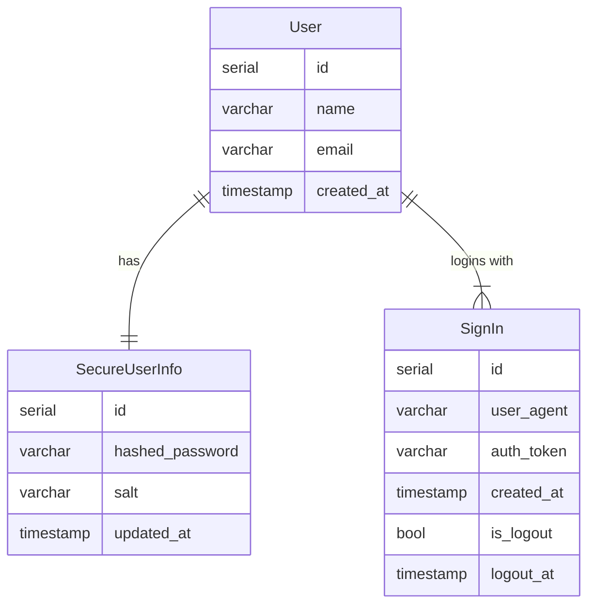

# Сервис авторизации проекта "PastaBean"

## Функицональные требования

__Для анонимного пользователя доступно:__
- регистрация аккаунта (email, login, password) - учесть уникальность email
- вход в аккаунт через email и password
- сброс пароля

__Для авторизированно пользователя доступно:__
- изменение пароля
- изменение логина
- просмотр активных сессий (время входа, User Agent)
- выход из системы

## Нефункциональные требования
- безопасность
- скорость ответа


## Детали реализации

### Инфраструктура
Для сервиса потребуются два хранилища:
- __PostgreSQL__ - для хранения информации о пользователях и всех сессиях
- __Redis__ - для хранения активных сессий и кодов для двухфакторной аутентификации

### Модель данных



## Архитектура

В сервисе явно выделены сервисы с бизнес-логикой, который оперируют интерфейсами репозиториев, которые в свою очередь ответственны за доступ к данным. 
При тестировании используются репозитории, которые хранят данные в оперативной памяти.

## Локальная разработка

### Запуск инфраструктуры
```bash
docker-compose up -d
```

### Запуск тестов
```bash
poetry run pytest tests
```